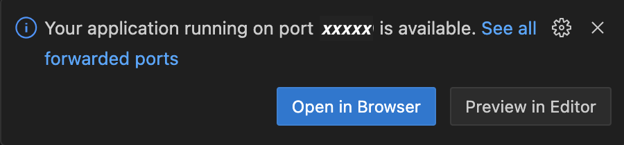
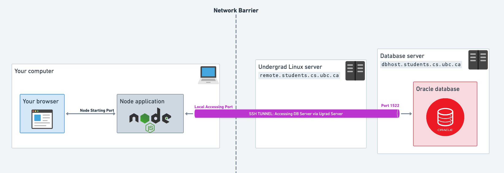
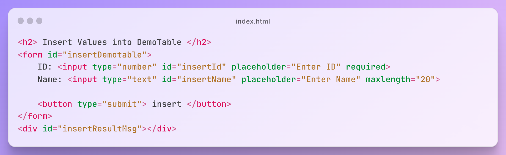
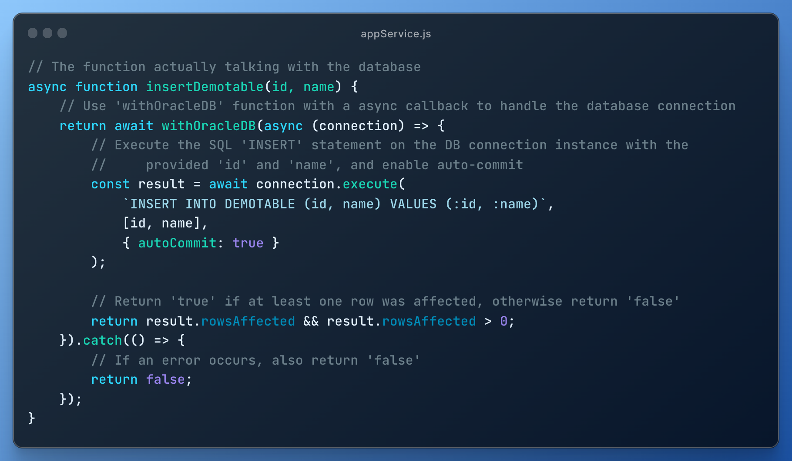
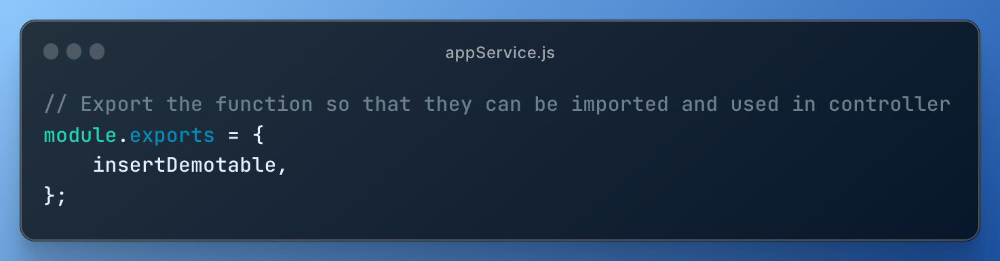
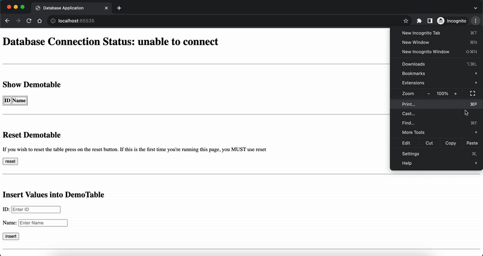
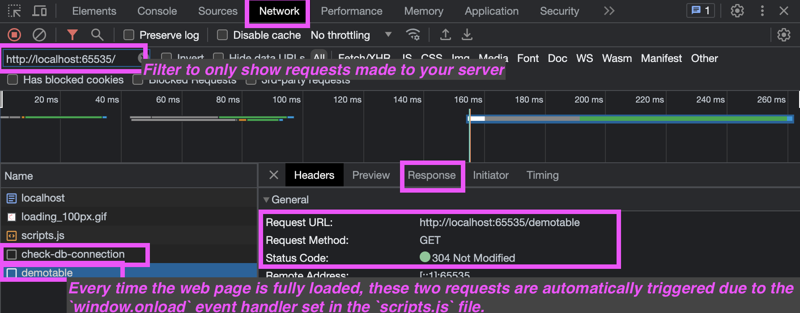

[CPSC304: Guide for Node.js/Oracle](#)

[Introduction](#introduction)

[DDL/DML](#ddl-dml-item) [Data Consistency](#data-consistency-item) [Client-Server](#client-server-item) [3-tier architecture](#architecture-item) [Port Number](#port-item) [SSH Tunneling](#ssh-tunnel-item)

[Choice of IDE](#choice-of-ide) [Set up Sample Project](#setup-sample-project)

[Deploy on the ugrad server](#remote-deploy-item) [Deploy locally](#local-deploy-item)

[Code Logic Explanation](#code-logic-explanation) [Debugging](#debugging)

Welcome
=======

to the supporting material for the 304 sample project, centered on the Node.js/Oracle tech stack. Using our sample project as a reference, this guide offers insights into creating your own project from scratch or building upon the provided sample. Through this, you'll gain a deeper understanding of how to construct a web application that interfaces with relational databases using Node.js.

Before we start, let's ensure we're all on the same page with some basic concepts:

Database DDL and DML
--------------------

There are two main categories of database queries: DDL and DML. DDL, or Data Definition Language, deals with defining and altering the structure of your database tables or the overall schema of your databases. This includes operations like creating, altering, and deleting tables. DML, or Data Manipulation Language, involves manipulating the data within the tables. This encompasses operations such as inserting, deleting, selecting, and updating records.  
Just like code, these queries must be executed to take effect.

Data Consistency Among the Group
--------------------------------

In our database system, each student has their own personal database space, separate from others. Think of this as your private area within the larger database, where you can create, modify, and delete tables and data without affecting anyone else. When you access the database with your unique username and password, you're directed to your personal database space.  
To ensure that you're working with the same set of data throughout your project, you have two options:

1.  Use the same username and password credentials to access the same database space consistently.
2.  Run the same reset SQL script among your group to repeat the (drop-create-insert) process and ensure everyone is working with identical data.

Client-Server
-------------

The client-server model describes the interaction between two computer programs in which one program, the client, makes a service request from another program, the server, which fulfills the request. For example, when you search on Google, your browser (the client) requests data from Google's machines (the server).

Frontend-Backend-Database (3-tier architecture)
-----------------------------------------------

In the context of software/web applications, we often talk about the frontend and the backend. The frontend is the visual and interactive aspect of an application, like the design and buttons on a website. Meanwhile, the backend, often residing on a server, processes requests, interacts with the database, and applies business logic.

Client-Server Interaction in a 3-Tier Approach
----------------------------------------------

In the client-server communication, the client retrieves data input by a user on the frontend and sends it as part of a request to the backend. The backend processes this request, performing logical operations and potentially manipulating data in the database. The processed data is then sent back to the frontend as a response, where it's rendered using frontend logic and code to be displayed to the user.

For example, consider an online shopping website. When you browse products, view images, and hover over buttons, you are interacting with the **frontend**, which runs on your device (**the client**). Once the final place-the-order button has been clicked, your device sends a **request** to the **server**. The server, which houses the **backend**, then checks inventory from their database, processes payment, and updates the **database** with your order details. Once these operations are completed, the server sends a **response** back to the client. Your device (the client) then displays this information on the **frontend**, possibly showing you a thank-you message. In this scenario, the frontend provides the user experience, while the backend ensures the operations are executed correctly, and the client-server model facilitates the communication between your device and the online shopping website's infrastructure.

Port Number
-----------

In network computing, a port is a specific endpoint for sending or receiving data on a computer. Just like an address tells you where someone lives in a city, a port number specifies where to deliver or receive data for a particular service on a computer. For instance, when you visit a website, your computer usually communicates using port numbers 80 (for HTTP) or 443 (for HTTPS).

SSH Tunneling
-------------

SSH tunneling, also known as SSH port forwarding, is a method that securely forwards traffic between network ports. When a service on a server isn't directly reachable, setting up an SSH tunnel allows you to create a secure, encrypted connection between a local port and the remote service port. This lets you interact seamlessly with the remote service, as if it were available on a local port of your own machine.

### Tech Stack

For this sample project, our primary language is [JavaScript](#javascript).

**JavaScript:** JavaScript is a dynamic programming language that's primarily used for enhancing interactivity within web browsers. It's the scripting language that browsers understand and can interpret. [More about JavaScript](https://developer.mozilla.org/en-US/docs/Web/JavaScript/Guide)

On the backend, we'll be using [Node.js](#nodejs) with [Express](#express) framework and the [oracledb](#oracledb) module. We also use the [dotenv](#dotenv) module to enhance security practices.

**Node.js:** Node.js is a runtime environment that enables JavaScript to run on the server-side, extending its use beyond web browsers. When we talk about using JavaScript on the backend, we often refer to it directly as "Node.js". [More about Node.js](https://nodejs.org/en/docs/guides/)

**Express.js:** Express.js is a framework for Node.js, simplifying the process of building web applications and APIs. [More about Express.js](https://expressjs.com/)

**oracledb:** The oracledb module is a Node.js driver for Oracle Database. It allows Node.js applications to connect to Oracle Database and execute SQL and PL/SQL statements. [More about oracledb](https://oracle.github.io/node-oracledb/)

**dotenv:** The dotenv Node.js module allows us to load environment variables from a `.env` file into `process.env` object in the format of key-value pairs. This helps in managing and securing sensitive information like database credentials in a Node.js application. [More about dotenv](https://github.com/motdotla/dotenv)

On the frontend, we'll keep things simple with a static webpage comprised of an [HTML](#html) file and a JavaScript file (We also provide an optional [CSS](#css) file, you can choose to use it or craft your own if you want to style your webpage further!). This approach ensures we don't delve deep into complex software or web application development, as our focus is on the database aspect.

**HTML:** HTML (HyperText Markup Language) is the standard language for creating web pages. It uses tags to structure content on the web page. [More about HTML](https://developer.mozilla.org/en-US/docs/Web/HTML)

**CSS:** CSS (Cascading Style Sheets) is a stylesheet language used for describing the look and formatting of a document written in HTML. It's used to control the layout of multiple web pages all at once, including aspects like layout, colors, and fonts. [More about CSS](https://developer.mozilla.org/en-US/docs/Web/CSS)

We hope this sample project, might serve as a skeleton, will help reduce your coding workload and allow you to concentrate more on designing a robust DB schema and crafting intricate queries!

#### Next Steps

In the following sections, we'll guide you through setting up the sample project, deploying it on our remote server or your local computer, and understanding the code logic for one of the functionalities from end-to-end. We'll also provide you with some ideas on choosing an IDE and debugging your project. Let's get started!

  

* * *

Choice of IDE
-------------

You're free to use ANY IDE of your choice. Both IntelliJ and Visual Studio Code, which you may have used in CPSC210 and CPSC221, are good choices. Other IDEs, such as WebStorm, Atom, and Eclipse, are also very suitable options. If you have a specific preference or just need something lighter, basic code editors like SublimeText or Notepad++ can also be used!

  

* * *

Set up Sample Project
---------------------

Download the zip file [here](node-demo.zip) and unzip it.

We've set up a Node.js environment for you on our remote ugrad server. Essential packages, such as express and oracledb, are pre-installed. We've also configured the references to these packages in the startup script for your runtime. If you prefer, you can set up an environment on your local machine, especially if you wish to use additional packages.

##### CAUTION!

Exercise caution when renaming files in this project. Only make changes if you're certain about all explicit and implicit dependencies linked to them.

Specifically, avoid renaming the following files:

* **`server.js`**
* **`.env`**

#### Deployment Options:

Follow the underlined steps **every time** you start the application. The steps without underlining only need to be done once, given that you don't make any changes to the correlated areas later.

**Deploy on the ugrad server**
------------------------------

Infrastructure Overview: Deploy remotely

* **Change database credential:**
    
    Open the .env file, adjust the database username and password based on the placeholder to configure the sample project to your own Oracle database.
  
* **Deploy the sample project:**
    
    * Transfer the unzipped folder to the remote server using the command below. Ensure you're in a parent directory of the unzipped folder.  
        You can also use other file transfer tools like Cyberduck.
        
        `scp -r <location of the project folder> YOUR-CWL-ID@remote.students.cs.ubc.ca:<destination on the server>`
        
* **Starting the Sample Project:**
    
    * SSH into the remote server:
        
        `ssh YOUR-CWL-ID@remote.students.cs.ubc.ca`
        
    * Navigate to the remote directory of the sample project.
    * Run the project's start script:
        
        This script is essential for starting the project on the remote server, as it includes important configurations for the node runtime environment.
        
        `sh ./remote-start.sh`
        
        After running the script, you should see a message in the terminal similar to: `Server running at http://localhost:**<node starting port number>**/`. Note down the `<node starting port number>`.
        
* **Building an SSH Tunnel to the Remote Node Application:**
    
    Sometimes, IDEs like Visual Studio Code can automatically handle port forwarding for you when you start the application remotely within their built-in SSH connection session. In such cases, you don't need to perform this step manually and you can directly access your application on that port
    
    
    
    We've provided a script to facilitate the SSH tunnel creation to the remote node application:
    
    * Open a new terminal in your local project folder.
    * Depending on your operating system:
        * Mac users:
            
            `sh ./scripts/mac/server-tunnel.sh`
            
        * Windows users:
            
            `.\\scripts\\win\\server-tunnel.cmd`
            
    * Follow the instructions in the terminal. You'll need to enter the `node starting port number` you noted earlier. The subsequent steps resemble the process of starting an SSH connection to the ugrad server.
      
    
* **Accessing the Sample Project:**
    
    After you've input your node's starting port number in the previous step, you should see a message similar to:
    
    -------------------------------------------------------------------------\-   
            You will be able to access your application at:   
            http://localhost:&lt;Local Accessing Port Number&gt;   
            after completing the steps below...   
    \-\-\-\-\-\-\-\-\-\-\-\-\-\-\-\-\-\-\-\-\-\-\-\-\-\-\-\-\-\-\-\-\-\-\-\-\-\-\-\-\-\-\-\-\-\-\-\-\-\-\-\-\-\-\-\-\-\-\-\-\-\-\-\-\-\-\-\-\-\-\-\-\-\-
    
    At this point, you can access the sample project via the provided URL.
    

**Deploy on your local environment** (Teaching group is not guaranteed to provide additional help with local set up)
--------------------------------------------------------------------------------------------------------------------

Infrastructure Overview: Deploy locally

* If you prefer running your code locally, follow the below steps:
    
    * **Install Node.js:**
        
        refer to its [official website](https://nodejs.org/en) for more details
    * **Change database credential:**
        
        Open the .env file, adjust the database username and password based on the placeholder to configure the sample project to your own Oracle database.
      
    * **Set up SSH tunneling to connect to your Oracle database:**
        
        We have provided a script to automate the process of setting up the tunnel. Please follow these steps:
        
        1.  Open a new terminal or command prompt window and navigate to the project's folder.
        2.  Depending on your operating system, run the appropriate command:
            * Mac users:
                
                `sh ./scripts/mac/db-tunnel.sh`
                
            * Windows users:
                
                `.\\scripts\\win\\db-tunnel.cmd`
            
        3.  After running the command, enter your CWL password when prompted. The subsequent steps will resemble the process of starting an SSH connection to the ugrad server. This also opens a command line on the remote server and has a timeout similar to an SSH connection.
            
    * **Install the required packages:** (Repeat this step if you/your teammates add more packages to the project through implementation)
        
        * After installing Node.js, verify its installation by running:
            
            `node --version`
            
        * Navigate your terminal to the project folder and run:  
            
            `npm install`
            
            This installs the required packages for the project. If you add new packages during development, run this command again to ensure those modules are added to your runtime library before starting the application.
            
    * **Oracle Instant Client Installation and Configuration:**
        
        To connect to the Oracle database using the oracleDB module, we need to install the Oracle Instant Client and set its path as an environment variable, which our application can reference during runtime.
        1.  **Download the Oracle Instant Client:**  
            Click the provided link to directly download the basic light version zip files. Alternatively, if you're using a different machine or prefer the basic version, visit [Oracle Instant Client Downloads](https://www.oracle.com/database/technologies/instant-client/downloads.html) page.
            * For Mac (Intel x86) users: [Basic Light Package (ZIP)](https://download.oracle.com/otn_software/mac/instantclient/198000/instantclient-basiclite-macos.x64-19.8.0.0.0dbru.zip)
            * For Windows (x64) users: [Basic Light Package (ZIP)](https://download.oracle.com/otn_software/nt/instantclient/1920000/instantclient-basiclite-windows.x64-19.20.0.0.0dbru.zip)
        2.  **Install Oracle Instant Client:**  
            Unzip the downloaded file to a directory of your choice.
        3.  **Get the absolute path:**  
            * Open a Terminal or Command Prompt and navigate into the unzipped folder of the Oracle Instant Client.
            
            * Mac users: Type `pwd` and press Enter to get the absolute path.
            * Windows users: Type `cd` and press Enter to get the absolute path.
            
            Please copy the absolute path and save it somewhere accessible, as we'll need it in the next step.
        4.  **Set the environment variable for your startup process:**  
            We've created scripts to help streamline the environment variable setup and application startup process.
            
            * Mac users: Run
                
                `sh ./scripts/mac/instantclient-setup.sh`
                
                in the Command Prompt in your project folder.
            * Windows users: Run
                
                `.\\scripts\\win\\instantclient-setup.cmd`
                
                in the Terminal in your project folder.
            
            You will need to copy the absolute path of the Oracle Instant Client, which you obtained in the previous step, into the command line. This will help generate a script named `local-start.sh` for Mac users and `local-start.cmd` for Windows users. These scripts include setting up the Oracle environment variables before actually starting the Node application.
            
    * **Start the sample project locally:**
        
        If you successfully ran the command in the previous step, you should see a message in the terminal similar to:
        
        \-\-\-\-\-\-\-\-\-\-\-\-\-\-\-\-\-\-\-\-\-\-\-\-\-\-\-\-\-\-\-\-\-\-\-\-\-\-\-\-\-\-\-\-\-\-\-\-\-\-\-\-\-\-\-\-\-\-\-\-\-\-\-\-\-\-\-\-\-\-\-\-\-\-  
        Setup complete. Run 'sh local-start.sh'/'local-start.cmd' in your project folder to start your Node.js application.  
        \-\-\-\-\-\-\-\-\-\-\-\-\-\-\-\-\-\-\-\-\-\-\-\-\-\-\-\-\-\-\-\-\-\-\-\-\-\-\-\-\-\-\-\-\-\-\-\-\-\-\-\-\-\-\-\-\-\-\-\-\-\-\-\-\-\-\-\-\-\-\-\-\-\-
        
        You can run the corresponding script to start the sample project.
        
    * **Access the Sample Project:**
        
        If you successfully started the application in the previous step, you should see a message in the terminal similar to: `Server running at http://localhost:<node starting port number>/`. You can access the sample project by entering this URL into your browser.
        
        If you encounter an error message like `Error: listen EADDRINUSE: address already in use :::<some port number>`, it means the port number specified in the .env file is already in use. In this case, simply change the value in the `PORT` field in the .env file to a different port number.
        

  

* * *

Explanation of the Code Logic for a Functionality, End-to-End
-------------------------------------------------------------

In our sample project, when you aim to build or adjust a functionality, there are typically four key areas where modifications are necessary:

### Front-end:

* `index.html`: This determines the appearance and information tagging on the web page.
* `scripts.js`: This handles frontend data parsing and rendering logic.

### Back-end:

* `appController.js`: This layer specifies the routes (URLs) to which our backend can respond. Depending on the frontend interaction, different routes will invoke different functions.
* `appService.js`: This is where the logic for each functionality resides. It's also the layer where we access the database.

The end-to-end data flow within our sample project, including interactions between the front-end files, the back-end layers, and the Oracle database.

#### Insert Function Example:

Let's take a closer look at the structural logic of our insert function as an example.

In our `index.html` file, the following code snippet represents the frontend section for this functionality. We have two input boxes: a number input with the identifier 'insertId' and a text input with the identifier 'insertName'. Additionally, there's a submit button and a placeholder to display messages.

In the `scripts.js` file, at the very bottom, we configure the logic associated with each user interaction on our webpage. When crafting your own application, ensure you adjust this configuration accordingly.

The main function for insertion first fetches the user's input data using their respective identifiers, then sends a request to our server with this data. Upon receiving a response, it displays the result message in the `index.html` file (our GUI).

Note that this function also invokes a table rendering function, ensuring our displayed table remains synchronized with our database. While not mandatory in your implementation, maintaining this synchronization is a good practice.

Transitioning to the backend, the `server.js` file serves as the starting point of our backend logic. In this file, we simply route all incoming requests to be handled by the controller, `appController.js`.

Transitioning to the backend, in the `appController.js` file, we first extract the values from the request received from the frontend. Next, these values are passed to the service layer for processing. If the operation is successful, a 'true' message is sent back to the frontend; otherwise, a 'false' message is sent.

(Sidenote: The format used in our request and response to capture data is called JSON, which stands for 'JavaScript Object Notation'. It's essentially an object notation, allowing you to access values using declared variable names. JSON can be multi-layered, so exercise caution when working with it to avoid potential issues.)

Finally, we delve into our service layer, `appService.js`. This section is paramount, especially since we're in a DATABASE COURSE. Here, we communicate directly with our database (in this example, the Oracle database). We utilize a "withOracleDB" helper function to establish and close the database connection. Through a lambda function, we obtain a database connection object, which is then used to execute our query.

Note: When making changes to table data (e.g., insert, update, delete), consider including the {autoCommit: true} option to ensure changes are committed to the database.

If any errors arise, we simply return 'false' to the controller, indicating an insertion error.

Lastly, don't forget to export the function in the `appService.js` that you want to use in the `appController.js`.

  

* * *

Debugging
---------

A typical debugging process can be broken down into four steps:

1.  Locate the Problem
2.  Understand the Error
3.  Attempt to Resolve the Problem
4.  Test the Solution

### 1\. Locate the Problem

#### 1.1 Broadly Identify the Area

First, determine which part of your application is causing the issue. Is it in the front-end, back-end, or the database?

A valuable tool for web project debugging is the browser's developer tools. In Google Chrome, you can access it by pressing F12 or by right-clicking on a webpage and selecting 'Inspect' (more information [here](https://developer.chrome.com/docs/devtools/open/)). If you're using a different browser, you might need to look up how to access its developer tool.

Using this tool, you can determine if the issue lies in the front-end or back-end logic. Examine the data received from requests. If the data is correct but rendered incorrectly on the webpage, the issue likely lies in the front-end. If the returned data itself is unexpected, the back-end logic might be at fault.

Backend errors will typically display messages in the console where your application started. This includes errors like Syntax, Run-Time, and Semantic Errors. However, logical errors won't produce such messages, so they can be trickier to spot and might require a thorough review of your code logic. To see error messages in the console, it's essential that errors are correctly caught and logged. Just as in Java and C++, severe errors might terminate the application.

In our sample application, Oracle error messages will also appear in the console, based on our connection helper function's logging logic. While errors during querying generally don't terminate the entire database, you should still exercise caution when performing actions that modify database data.

#### 1.2 Pinpoint the Error to a Specific Line

For JavaScript debugging (both front-end and back-end), you can use the standard JavaScript logging function, `console.log()`. Logs will display in the browser's web console for front-end issues and in the terminal or command prompt for back-end issues. More about [console.log()](https://developer.mozilla.org/en-US/docs/Web/API/Console/log).

If you prefer stepping through code and pausing at specific lines:

* For the front-end, use the developer tools in your browser. More on this [here](https://javascript.info/debugging-chrome).
* For back-end debugging, you'll need [Node.js installed on your computer to run the application locally](#local-deploy-item). Some IDEs, such as IntelliJ Ultimate and Visual Studio Code, offer line-by-line debugging capabilities. Using these IDEs after proper configuration, you can select the 'Run -> Debug' option when your entry point file (e.g., server.js) is open.

### 2\. Understand the Error Message

This step can present a myriad of messages! If unsure, consider searching online or on Piazza to see if others have encountered similar issues. Logical errors won't produce explicit error messages, so understanding them often requires a thorough code review and examining your logs.

### 3\. Attempt to Resolve the Problem

For this step, you'll rely on your understanding and problem-solving skills. By this point, you should have a clearer idea of how to address the issues.

### 4\. Test the Solution

After making your adjustments, ensure you test the solution to verify that the issue has been resolved.